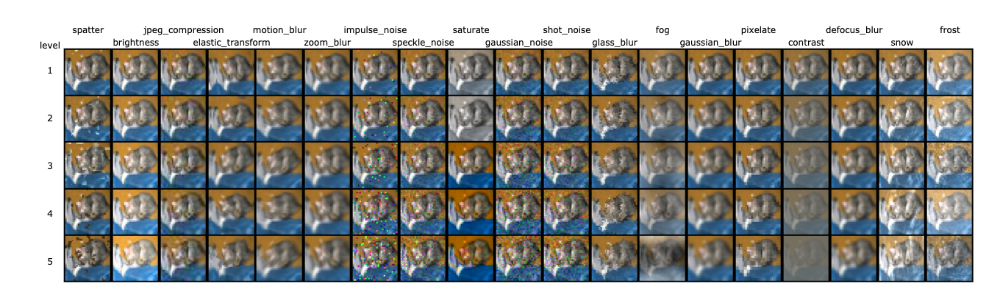

# Evaluating a model performance for [CIFAR10-C](https://arxiv.org/abs/1807.01697) (PyTorch)



## Preparation
### Download data
Download CIFAR10-C dataset from [here](https://zenodo.org/record/2535967#.XncuG5P7TUJ).  

### (Optional) Set your model
A default model is [ResNet56](https://arxiv.org/abs/1512.03385). it's model file is already contained in `src/models/`.  
If you use your custom model, please do the following procedure.
- Add your model file to `src/models/`. 
- Add a new model option to `test.py`.

## Evaluation
```
# ResNet56 (default)
python src/test.py --weight_path <path/to/weight/file> --data_root <path/to/parent/directory/of/cifar10-c>

# Your custom model
python src/test.py --arch <your/model/name> --weight_path <path/to/weight/file> --data_root <path/to/parent/directory/of/cifar10-c>
```

### Output 
All corruption accuracy.  
This figure will be saved in `figs/`.


### (Optional) Other Useful Options
- `fig_dir` : Specify the directory path to save an output figure.
- `weight_dir` : Execute an evaluation for all weight files in the specified directory.
- `corruptions` : Evaluate a model performance for the specified corruption types.